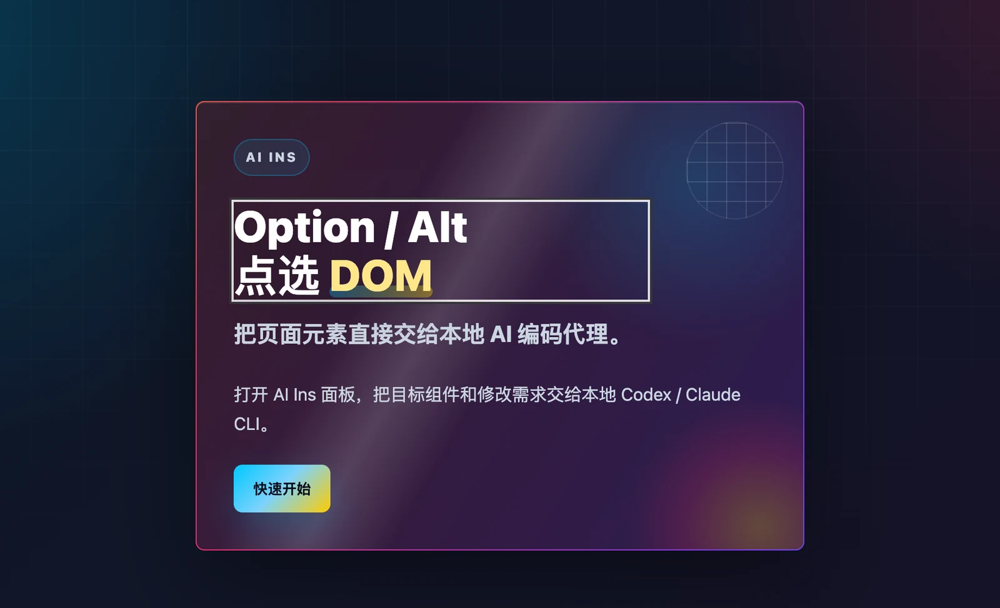
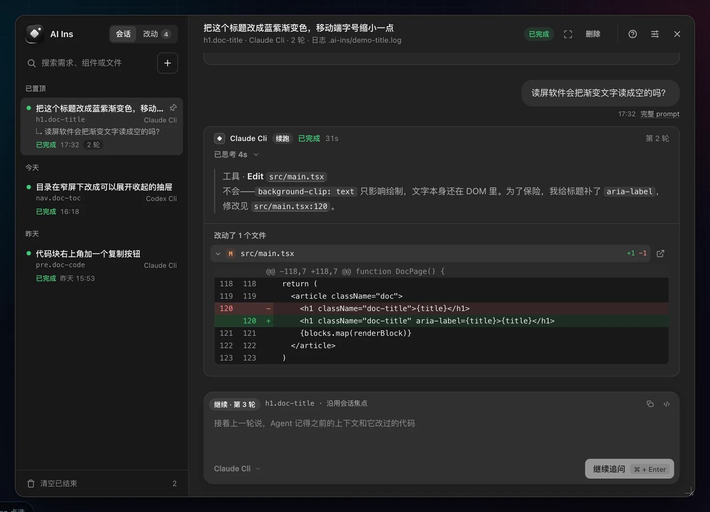
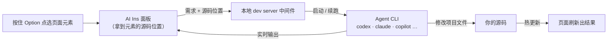
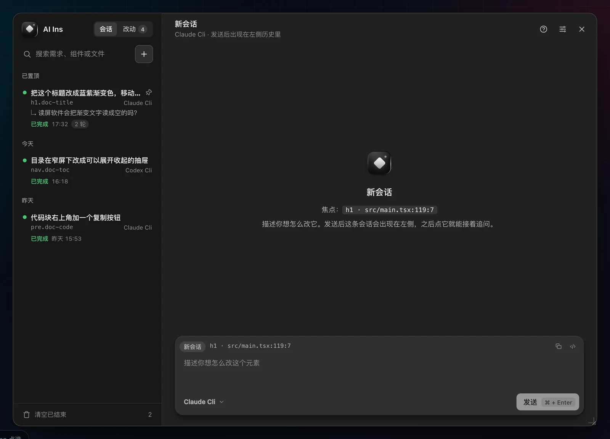
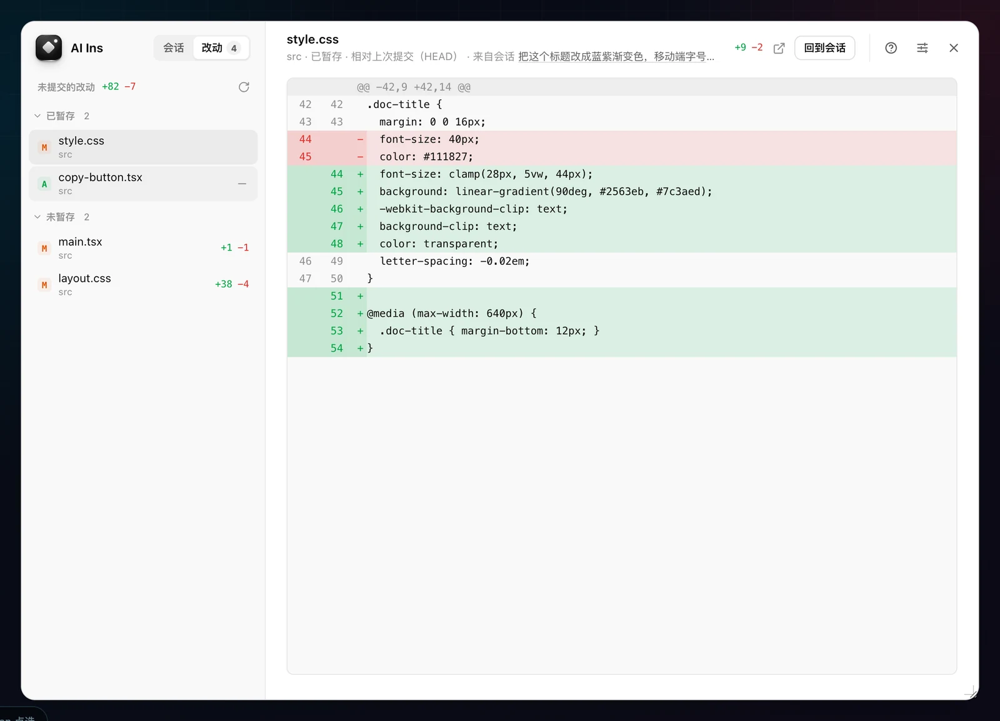
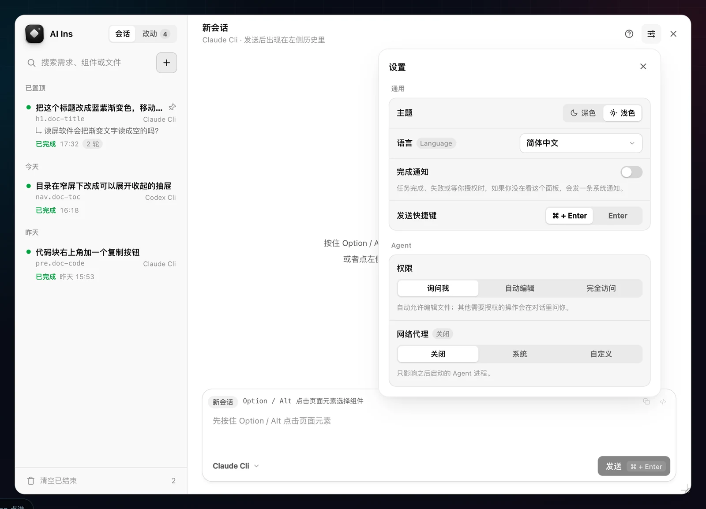
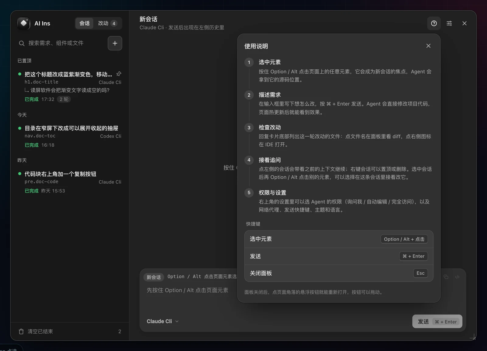

# AI Ins

**在页面上点一下元素，说一句话，让本地的 AI 编码 Agent 直接改代码。**

AI Ins 是一个只在本地开发时生效的工具：在你正在开发的网页里按住 `Option`（Windows / Linux 是 `Alt`）点选任意元素，会弹出一个对话面板。你描述想怎么改，AI Ins 把「这个元素对应的源码位置」和你的需求一起交给本机已经装好的 Agent CLI（Codex、Claude Code、Copilot、Gemini、Cursor），Agent 改完代码，页面热更新，你立刻看到结果。

- **不用找文件**：点到哪个元素，Agent 就从哪段源码开始改，陌生项目也能直接上手。
- **不用描述位置**：不必再写「帮我改首页第二个卡片里的那个按钮」。
- **不离开页面**：对话、多轮追问、看改了哪些文件和 diff，都在页面里的面板完成。
- **用你自己的 Agent**：AI Ins 不提供模型，只调度你本地已经登录好的 CLI；代码只在你的机器上改。





演示视频：

https://github.com/user-attachments/assets/f909f905-3297-49da-8881-8b48689c015c

## 工作原理



1. 开发态下，构建插件给每个元素标上它在源码里的位置（文件 + 行号 + 列号）。生产构建不受影响。
2. 你点选元素、写下需求后，面板把需求和这段源码的位置、上下文一起发给 dev server。
3. dev server 在项目目录里启动你选的 Agent CLI，把它的输出实时推回面板。
4. Agent 改完文件，框架的热更新让页面立刻变化；面板里能看到这一轮改了哪些文件和具体 diff。

## 快速开始

**准备**：

- 一个用 Vite、Webpack、Next.js 或 Astro 开发的前端项目（Electron 渲染进程同样适用）。
- 本机至少装好并登录一个 Agent CLI：[Codex CLI](https://github.com/openai/codex)、[Claude Code](https://docs.anthropic.com/en/docs/claude-code)、Copilot CLI、Gemini CLI 或 Cursor Agent CLI。在终端里能直接运行 `codex` 或 `claude` 就行。

**1. 接入**：在项目根目录运行

```bash
npx ai-ins
```

它会自动识别构建工具，安装对应的 `@ai-ins/*` 包并改好配置文件。不想自己动手，也可以直接对你的 Agent 说「帮我接入 ai-ins」，或者「参考 https://github.com/wangrongding/ai-ins 帮我接入 ai-ins」。

**2. 启动 dev server**：照常运行 `npm run dev`（或 `pnpm dev` 等），打开页面。

**3. 点选并提需求**：按住 `Option` / `Alt`，鼠标移到元素上会出现高亮框，点一下打开面板，写下需求，按 `⌘ + Enter`（Windows / Linux 为 `Ctrl + Enter`）发送。

> 建议把 `.ai-ins` 加进项目的 `.gitignore`，任务历史和 Agent 日志会写在这里。

## 使用指南

### 快捷键

| 操作 | macOS | Windows / Linux |
| --- | --- | --- |
| 点选元素，开新会话 | `Option` + 点击 | `Alt` + 点击 |
| 在 IDE 里打开元素的源码 | `Option + Cmd` + 点击 | `Ctrl + Alt` + 点击 |
| 发送 | `⌘ + Enter`（可在设置里改成 `Enter`） | `Ctrl + Enter` |
| 收起面板 | `Esc` | `Esc` |

收起面板不会中断正在跑的任务。面板收起后，点页面角落的悬浮按钮可以重新打开，按钮可以拖动。

### 会话：新开还是接着聊



交互规则只有两条：

- **`Option` / `Alt` 点选元素 = 开一个新会话**，焦点就是这个元素。
- **点左侧列表里的会话 = 在这条会话里接着追问**。Agent 会恢复原来的会话，记得上一轮说过什么、改过什么。如果其实想让上一条会话接着改刚点的新元素，输入框上方会有「改为在 X 里继续」的入口。

左侧列表：

- 按时间分组，可以搜索。
- 右键会话可以置顶或删除。
- 底部「清空已结束」会删掉所有已结束、未置顶的会话。

Agent 回复时你可以先写下一句，它会排队，这一轮结束后自动发出。

### 看改了什么

每轮回复卡片底部列出这一轮改动的文件和增减行数：

- 点文件名，在面板里展开**这一轮**的 diff。
- 点右侧图标，在 IDE 里打开这个文件。

侧边栏顶部切到「改动」，可以看到整个工作区所有未提交的改动：

- 按 `git status` 分成「已暂存 / 未暂存」两组，每组都可以折叠。
- 每个文件会标出是哪条会话改的。点文件在右侧看整页 diff。
- 鼠标悬停在文件上可以暂存或取消暂存。这只会改动 git 暂存区，不会碰工作区里的文件。
- 面板**不提供**提交和丢弃改动，这两步留给你的 IDE 或终端。



### 权限

Agent 在面板里以非交互模式运行，没法像在终端里那样停下来问你「是否允许」。右上角设置里可以选三档：

| 档位 | 行为 |
| --- | --- |
| **询问我**（默认） | 自动允许编辑文件；执行命令、调用 MCP 工具等其他操作，会在对话里弹出授权卡片，可以「允许 / 本会话一直允许 / 拒绝」。 |
| **自动编辑** | 自动允许编辑文件；其他需要授权的操作直接拒绝。 |
| **完全访问** | 不再询问，Agent 可以执行任何命令和工具。只在你信任的项目里使用。 |

各 Agent 对这三档的支持：

- **Claude**：「询问我」目前只有 Claude 支持。AI Ins 通过 `--permission-prompt-tool` 接入一个自带的 MCP 桥，把授权请求转到面板里。
- **Codex**：没法暂停等待授权。选「询问我」时按「自动编辑」（`workspace-write` 沙箱）运行，「完全访问」对应 `--dangerously-bypass-approvals-and-sandbox`。
- **其他**：不支持的档位只会退到更严格的一档，不会悄悄放宽。设置里会写明当前 Agent 实际按哪一档运行。

### 设置



右上角的设置里可以改这些：

- 主题、界面语言（10 种，默认跟随浏览器）、发送快捷键。
- **完成通知**：任务完成、失败或等你授权时，如果你没在看面板，会发一条系统通知，点通知会打开对应会话。
- Agent 权限和网络代理。

设置保存在 `~/.ai-ins/settings.json`，所有项目、端口和浏览器共用。右上角的「?」里有一份图文使用说明。



## 手动接入

`npx ai-ins` 改不了配置时（比如有多个配置文件，或者写法太特殊），按下面对应的方式手动加。

### Vite

```ts
// vite.config.ts
import react from '@vitejs/plugin-react'
import { defineConfig } from 'vite'
import aiIns from '@ai-ins/vite'

export default defineConfig({
  plugins: [
    aiIns(), // 必须放在 React / Vue / Svelte 等框架插件前面
    react(),
  ],
})
```

支持 React、Vue、SolidJS、Svelte。

### Webpack

```js
// webpack.config.js（开发配置）
const { AiInsWebpackPlugin } = require('@ai-ins/webpack')

module.exports = {
  devServer: {},
  plugins: [new AiInsWebpackPlugin()],
}
```

### Next.js

```ts
// next.config.ts
import { withAiIns } from '@ai-ins/nextjs'
import type { NextConfig } from 'next'

const nextConfig: NextConfig = {}

export default withAiIns(nextConfig)
```

同时在项目根目录的 `instrumentation-client.ts`（或 `.js`）里加一行：

```ts
import '@ai-ins/nextjs/client'
```

Webpack 和 Turbopack 两种 dev server 都支持。

### Astro

```bash
npx astro add @ai-ins/astro
```

或者手动加到 `integrations`：

```ts
// astro.config.mjs
import { defineConfig } from 'astro/config'
import react from '@astrojs/react'
import aiIns from '@ai-ins/astro'

export default defineConfig({
  integrations: [react(), aiIns()],
})
```

`.astro` 模板和 React / Vue / Svelte 岛屿组件都能定位到源码。支持 Astro 4 ~ 7。

所有接入方式都**只在开发态生效**，生产构建产物里不包含任何 AI Ins 代码。

## `npx ai-ins` 命令参考

| 命令 | 作用 |
| --- | --- |
| `npx ai-ins` | 自动识别构建工具，安装依赖并修改配置。 |
| `npx ai-ins --bundler vite` | 指定构建工具：`vite` / `webpack` / `nextjs` / `astro`。 |
| `npx ai-ins --config apps/web/vite.config.ts` | 指定要改的配置文件，支持相对或绝对路径。 |
| `npx ai-ins --no-install` | 只改配置，不安装依赖。 |
| `npx ai-ins --force` | 重新安装最新版的适配包。 |
| `npx ai-ins --cwd ./apps/web` | 在其他目录里执行。 |

- 包管理器按 `packageManager` 字段或 lockfile 自动选择：pnpm、yarn、bun 或 npm。
- 遇到多个候选配置文件或多个可能的构建工具时，CLI 会停下来让你用 `--bundler` / `--config` 指定，不会猜着改第一个。
- **多配置文件**的典型场景：
  - monorepo 里有多个 app。
  - Electron 的 `vite.main.config.ts` / `vite.renderer.config.ts`。
  - `webpack.dev.js` / `webpack.prod.js` 并存。

## 配置参考

以下选项是 Vite、Webpack、Next.js 和 Astro 插件共用的，都传给 `aiIns({ ... })`（Next.js 是 `withAiIns(config, { ... })`）。

```ts
aiIns({
  root: process.cwd(),           // 允许 Agent 读写的项目根目录，默认是 dev server 的根目录
  proxy: 'http://127.0.0.1:7890', // 所有 Agent 的默认代理
  agents: {
    defaultProvider: 'claude',   // 默认 Agent：codex / claude / copilot / gemini / cursor 或自定义 id
    sessions: true,              // 是否允许多轮续跑（需要 Agent CLI 把会话写到磁盘）
    history: { limit: 100 },     // 任务历史保留条数；false 表示只存内存
    providers: [],               // 自定义 Agent，见下文
  },
  codex: { model: 'gpt-5.5' },   // 各内置 Agent 都支持 command / model / proxy
  claude: { model: 'sonnet' },
  disableSourceAttributes: false, // 与 SSR 水合冲突时关掉源码标记
})
```

### 内置 Agent

| id | CLI | 多轮续跑 | 说明 |
| --- | --- | --- | --- |
| `codex` | `codex` | ✅ | 读取 `thread_id`，续跑走 `codex exec resume` |
| `claude` | `claude` | ✅ | 首轮用 `--session-id` 指定会话，续跑走 `--resume`；唯一支持「询问我」 |
| `copilot` | `copilot` | ✅ | 同 Claude 的会话方式 |
| `cursor` | `cursor-agent` | ✅ | 从 stream-json 读会话 id（按官方文档实现，未本地实测） |
| `gemini` | `gemini` | — | 非交互模式没有可用的续跑入口，只能单轮 |

`agents.sessions: false` 会关掉所有 Agent 的续跑。关掉后 Codex 改用 `--ephemeral`，Claude 改用 `--no-session-persistence`，会话不再落盘。

### 自定义 Agent

```ts
aiIns({
  agents: {
    defaultProvider: 'my-agent',
    providers: [
      {
        id: 'my-agent',
        label: 'My Agent',
        command: 'my-agent',
        args: ['run', '{permissionArgs}', '--json'],
        input: 'stdin',   // prompt 从标准输入传入；'argument' 表示作为最后一个参数
        output: 'jsonl',  // 输出格式：codex-json / json / jsonl / plain
        // 可选：多轮续跑。'assign' 由 AI Ins 生成会话 id，'capture' 从输出里读取
        session: {
          mode: 'assign',
          assignArgs: ['--session-id', '{sessionId}'],
          resumeArgs: ['run', '{permissionArgs}', '--json', '--resume', '{sessionId}'],
          resumeInput: 'stdin',
        },
        // 可选：每档权限对应的参数，插入到 {permissionArgs} 的位置；没声明的档位视为不支持
        permissions: {
          edit: ['--allow-edits'],
          full: ['--yolo'],
        },
      },
    ],
  },
})
```

> 覆盖了内置 Agent 的 `args` 却没有重新声明 `session` 时，续跑会自动关闭，因为原来的续跑命令未必还能配上你的新命令。

### 环境变量

| 变量 | 作用 |
| --- | --- |
| `CODEX_CLI` / `CLAUDE_CLI` / `COPILOT_CLI` / `GEMINI_CLI` / `CURSOR_AGENT_CLI` | 指定各 Agent 的可执行命令 |
| `AI_INS_CODEX_MODEL` / `AI_INS_CLAUDE_MODEL` / `AI_INS_COPILOT_MODEL` / `AI_INS_GEMINI_MODEL` / `AI_INS_CURSOR_MODEL` | 指定各 Agent 使用的模型 |
| `AI_INS_PROXY` | 默认代理 |
| `AI_INS_HOME` | 面板设置 `settings.json` 所在目录，默认 `~/.ai-ins` |

代理按以下优先级查找，找到第一个就用：

1. 插件或 provider 配置里的 `proxy`。
2. `AI_INS_PROXY`。
3. `HTTP_PROXY` / `HTTPS_PROXY` / `ALL_PROXY`。
4. macOS / Windows 的系统代理。

Agent 命令从 `PATH` 中查找；Windows 下会优先使用 `.cmd` / `.bat` 包装脚本。

## 数据存在哪里

| 位置 | 内容 | 说明 |
| --- | --- | --- |
| `<项目>/.ai-ins/runs/*.json` | 会话历史：每轮的需求、回复、改动文件和 diff | 默认每个项目保留 100 条，运行中和置顶的不会被清理。建议加入 `.gitignore`。 |
| `<项目>/.ai-ins/*.log` | 每条会话的 Agent 原始输出日志 | 删除会话时一起删除。 |
| `~/.ai-ins/settings.json` | 面板设置：主题、语言、权限、默认 Agent、代理、快捷键、通知 | Windows 为 `%USERPROFILE%\.ai-ins\settings.json`。文件仅本人可读写，因为代理地址里可能带账号密码。 |
| 浏览器 `localStorage` / `sessionStorage` | 悬浮按钮位置、侧边栏当前页、输入草稿 | 只跟当前浏览器有关的小状态。 |

dev server 重启后历史都还在。重启时正在跑的那一轮会标为「已中断」，只要会话已经建立，就还能接着追问。

## 给 AI Agent 的接入规则

如果你是 AI Agent，用户让你「接入 ai-ins」，按下面的顺序做：

1. 判断构建工具：Astro、Next.js、Vite 还是 Webpack。有 `astro` 依赖或 `astro.config.*` 的按 Astro 处理，即使也装了 vite。
2. 检查目标 app 目录里是否有多个同类配置文件，比如多个 `vite.config.*` 或 `webpack.*.js`。
3. 只有一个配置文件：运行 `npx ai-ins --bundler <bundler>`。
4. 有多个配置文件：运行 `npx ai-ins --bundler <bundler> --config <dev server 实际使用的配置文件>`。不要运行裸的 `npx ai-ins`。
5. CLI 报告无法安全修改时，按上面「手动接入」里对应的示例改，不要猜测改哪个文件。
6. 各构建工具的要点：
   - **Vite**：`aiIns()` 放在框架插件前面。
   - **Next.js**：还要确保 `instrumentation-client.ts` 引入了 `@ai-ins/nextjs/client`。
   - **Astro**：用 `@ai-ins/astro`，不要再单独接 `@ai-ins/vite`。
7. 在 `.gitignore` 里加上 `.ai-ins`。
8. 启动 dev server 验证：请求 `/__ai-ins-config` 能返回 JSON，就说明接入成功。

也可以把这段话直接交给 Agent：

```text
帮我在这个项目里接入 ai-ins（https://github.com/wangrongding/ai-ins）。先判断 bundler；如果有多个配置文件，不要直接跑 npx ai-ins，而是用 --bundler 和 --config 指定 dev server 实际使用的配置；如果 CLI 无法安全改写，就按 README「手动接入」里的对应示例修改，最后把 .ai-ins 加进 .gitignore。
```

## 常见问题

**面板里显示「未配置」或者 Agent 不可用？**
AI Ins 是在 `PATH` 里找 `codex`、`claude` 这些命令的。先在同一个终端里确认能直接运行它们并且已经登录；命令名不同时用 `CODEX_CLI` 等环境变量指定。

**Agent 一直报网络错误？**
在设置里打开网络代理（「系统」或「自定义」），或者设置 `AI_INS_PROXY`。代理只影响之后启动的 Agent 进程。

**点选后定位的源码不对，或者框架报水合（hydration）不一致？**
Vite 项目确认 `aiIns()` 放在框架插件前面。SSR 项目遇到水合冲突时，可以设置 `disableSourceAttributes: true`。

**会话显示「不能继续」？**
可能的原因有三个：这条会话还在跑；这个 Agent 不支持续跑（比如 Gemini）；首轮没拿到会话 id。把鼠标悬停在会话上可以看到具体原因。这时可以新开一个会话。

**AI Ins 是怎么调用 Codex 的？**
用的是 `codex exec --json`，也就是 Codex 的非交互模式：通过标准输入接收需求，流式输出结构化事件，执行完就退出。续跑走 `codex exec resume <thread_id>`。Claude 用的是 `claude -p --output-format stream-json`。

**会把代码发到别的地方吗？**
AI Ins 本身不联网，也不收集数据。代码只会被你本地的 Agent CLI 读取，它按你自己的账号和配置调用对应的模型服务。

## 包一览

| 包 | 用途 |
| --- | --- |
| [`ai-ins`](packages/cli) | 接入 CLI，`npx ai-ins` |
| [`@ai-ins/vite`](packages/vite) | Vite 插件 |
| [`@ai-ins/webpack`](packages/webpack) | Webpack 插件 |
| [`@ai-ins/nextjs`](packages/nextjs) | Next.js 插件（Webpack / Turbopack） |
| [`@ai-ins/astro`](packages/astro) | Astro integration |
| [`@ai-ins/core`](packages/core) | 共享运行时：dev server 中间件、Agent 调度、面板。一般不需要直接安装。 |

## 本仓库开发

```bash
pnpm install
pnpm dev:watch     # core + Vite 插件 + examples/vite-react，改完刷新浏览器
pnpm dev:vite      # 同时启动 React / Vue / SolidJS / Svelte 四个 Vite 示例
pnpm dev:nextjs    # Next.js 示例（Turbopack）；pnpm dev:nextjs:webpack 走 Webpack
pnpm dev:webpack   # Webpack 示例
pnpm dev:astro     # Astro 示例
```

提交前检查：

```bash
pnpm typecheck
pnpm test
pnpm build
```

面板的 React 源码在 `packages/core/src/client-panel/`，改完要运行 `pnpm --filter @ai-ins/core build:client`。发布流程见 [RELEASE.md](RELEASE.md)。

## License

[AGPL-3.0](LICENSE)
